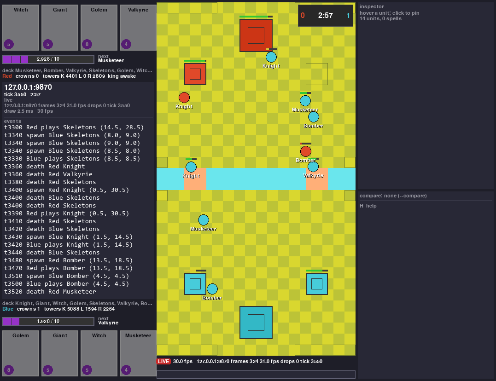

# RoyaleViser

Watch a Clash Royale battle tick by tick — a recorded match, an engine trace, or a self-play
training run happening right now — in a window that is a separate process from whatever
produced the battle. The viewer draws the arena, both players' hands, elixir and cycle, every
unit with its hp bar, path and target, spells and projectiles, an event log and an inspector
with every raw field of the unit you click. It can also put two recordings of the same battle
on one board and tell you, tick by tick, where they disagree.


A self-play battle on the RoyaleSim engine, recorded to a trace and reopened in the viewer: the
Blue Valkyrie is pinned (click a unit), so the inspector on the right lists everything the
source carries for it — position in raw engine units and in tiles, hp, radius, flying, deploy
and stun counters, target, path, and the per-source extras. The left column is the event log
and both players' hands, elixir (to a thousandth) and next card; the bar under the board seeks
the replay. This image was rendered headless, with `SDL_VIDEODRIVER=dummy` and `--shot`.

## Open a battle

```
python -m royaleviser frames-<label>-<stamp>.jsonl.gz            # a recorded match, 20 Hz
python -m royaleviser trace.msgpack --start-tick 904             # an engine trace
python -m royaleviser --stream 127.0.0.1:9870                    # an engine running right now
python -m royaleviser a.jsonl.gz --compare b.jsonl.gz --speed 4  # two recordings, one board
```

One window reads all three, because every source is converted to the same frame model before
anything is drawn (`royaleviser.model.Frame`, [below](#the-three-sources)). A recorded match
opens in 0.1-0.2 s — a 4047-frame gzipped recording in 0.10 s, via a line index and a parse
cache, so a seek is one `json.loads`.

Nothing to watch yet? With only this repo installed (`pip install -e .` — pygame, msgspec,
numpy), `python tests/run_synthetic.py --seconds 8` opens the window on a scripted two-minute
battle. With [RoyaleGym](https://github.com/RoyaleGym/RoyaleGym) and the engine installed too,
this records a self-play battle on the engine and writes a trace like the one above:

```python
import numpy as np
from royalegym.env import ClashParallelEnv
from royalegym.replay import ReplayRecorder, save_trace
from royalegym.rust_engine import RustEngine
from royalegym.selfplay import RandomLegalOpponent
from royalegym.done_condition import GameOverCondition, StepLimitCondition

rec = ReplayRecorder(frame_every_tick=True)
env = ClashParallelEnv(RustEngine(), recorder=rec,
                       termination_cond=GameOverCondition(), truncation_cond=StepLimitCondition(200))
obs, _ = env.reset(seed=2026)
rng, opp = np.random.default_rng(0), RandomLegalOpponent(noop_prob=0.3)
while env.agents:
    obs, *_ = env.step({a: opp.act(obs[a], obs[a]["action_mask"], rng) for a in env.agents})
save_trace(rec.trace, "battle.msgpack")      # 200 steps -> 2001 frames, one per engine tick
```

```
python -m royaleviser battle.msgpack --start-tick 900
```

What the window gives you:

- **The board** at 18 x 32 tiles: towers, troops, buildings, hp bars, names, unit paths, target
  lines, spells and projectiles, tower and no-deploy zones, the match timer, crowns, `OVERTIME`,
  and a `GAME OVER` banner with the winner.
- **Both players**: hand with card costs (dimmed when they cost more elixir than you have), the
  elixir bar in thousandths, the next card and the rest of the cycle, tower hp, and the king's
  activation state.
- **An inspector** on the hovered unit, pinned by clicking it: every field the source carries,
  raw, with no rounding and no interpretation.
- **An event log**: plays, spawns, deaths, and a line per underground trip for the cards that
  tunnel.
- **Transport**: play/pause, step one frame or twenty, seek by clicking the bar, speed x2 / x0.5,
  first/last frame, flip which side sits at the bottom, and `S` for a PNG of the window.
- **Honest gaps.** A source says what it does not know instead of guessing: an opponent's hand a
  recording does not carry prints as "hand: not in this source", not as a plausible guess.

## Compare two recordings of one battle

Give a second source (a second path, or `--compare`) and it is ghosted onto the board as hollow
white shapes at the primary's tick and compared with it tick by tick. The comparison is on the
multiset of `(team, name, x, y, hp)` over one tick's units: for two recordings of one battle
that multiset must be equal, since entity ids differ between clients but nothing else does. The
panel prints `tick T: N entities, M differ` and the running `K ticks compared, D differ`
(`app.Compare`; a replay seeks the second source to the exact tick, live sources are matched
through a 60-tick buffer).

Measured on the two seats of one recorded battle (client 16.402): **2404 ticks compared, 3
differ** — all three on tap ticks, where the two recordings disagree for a single frame. An
engine trace is compared against the recording it was calibrated on in exactly the same way, in
milli-tiles: this is how the engine's divergence from the real game is found and watched.

## Watch a training run live



The same window, attached to a self-play environment stepping in another process: `LIVE`, the
frame rate it is receiving, a felled princess tower (the empty square), and a crown on the
scoreboard.

```
env = ClashParallelEnv(viser=ViserPublisher())        # 127.0.0.1:9870
set ROYALEVISER=127.0.0.1:9870                        # the same, without touching the constructor
python -m royaleviser --stream 127.0.0.1:9870         # in another process
```

The viewer must never be in the tick loop and must cost nothing when nobody is watching, so the
engine side is a UDP publisher that only speaks while a viewer's heartbeat is fresh:

1. The viewer binds a UDP socket and sends `STREAM_HELLO` to the publisher's `host:port`
   (default `127.0.0.1:9870`) once a second while it is open (from `StreamSource.frame()`).
2. The env calls `publish` once per `reset()` / `step()`, and only when a publisher is set
   (`viser=` or the environment variable; `None` costs one `if`). While no heartbeat has arrived
   in `ATTACH_TIMEOUT_S` (3 s), `publish` returns after one clock read — **193 ns per call**,
   measured 2026-09-21 over 200k calls — and it polls its socket for heartbeats at most once a
   second.
3. While attached it sends one msgpack datagram per call to the last heartbeat's address
   (measured: 2.6 KB for 12 units and 6 towers, 11 KB for 60 entities). A datagram over 65507
   bytes is resent with unit paths emptied, then dropped and counted.
4. `royalegym.viser.frame_dict` builds the wire dict from a `BattleState`;
   `sources.frame_from_state` turns it into a `Frame`, and `TraceSource` uses the same unit and
   spell rows — so a trace and a stream of one battle draw identically. Spawn, death and play
   lines come from the publisher (uid diffing, accepted deploys).

Measured on a RustEngine self-play run (2026-09-21): 360 env steps in 11.9 s, 329 datagrams
sent, 0 dropped; the viewer drew 335 frames of it. The ~31 steps that ran before the publisher's
once-a-second heartbeat poll noticed the viewer are the difference. The stream carries **one
frame per env step** (`decision_ms` worth of ticks, 10 at the defaults), not one per engine
tick; for a per-tick view, record with `ReplayRecorder(frame_every_tick=True)` and open the
trace.

## Cost

Every draw is a full repaint of the window, and it costs single-digit milliseconds at 24
px/tile: 2.2-2.7 ms mean over recorded matches, traces and streams measured 2026-09-20, and
5.1 ms mean on the RustEngine trace and stream runs quoted above, which ran with several other
jobs on the same machine. The per-run table is in [`docs/internals.md`](docs/internals.md).
That is far inside both the 20 Hz replay budget and the 60 Hz window cap, which is why the
viewer is still Python and pygame rather than a Rust process on a shared buffer.

The window is redrawn only when the frame or the view changed (60 fps cap). A replay is paced
by the frame's `tick_ms` times the speed and steps through every frame it skips, so the events
and the compare totals see them all. On exit the process prints
`royaleviser: N draws, mean X ms, max Y ms`; the max is always the first draw, which builds the
board surface and the fonts.

## Keys

| Key | Action |
|---|---|
| space | play / pause (replays) |
| left / right | step a frame (shift: 20) |
| home / end | first / last frame |
| + / - | speed x2 / x0.5 (also ] [) |
| wheel | step frames |
| f | flip the seat |
| p | unit paths |
| t | target lines |
| g | tile grid |
| d | debug numbers |
| c | compare ghost |
| h | this help |
| s / F12 | save a PNG |
| click | pin a unit / seek the timeline |
| escape / q | quit |

The list is `royaleviser.app.KEYS` (`--help` and the H footer print it). For unattended runs,
`--seconds N` quits by itself and `--shot PATH` writes the last drawn window as a PNG;
`SDL_VIDEODRIVER=dummy` makes both work with no display at all, which is how this page's images
and the render tests are produced.

`--seat local` (the default) seats the primary source's local player at the bottom once the
source knows it; `0` and `1` pin a team. `--geometry WxH+X+Y` places the window and picks the
largest tile scale whose layout fits (under 16 px/tile the inspector column is dropped and the
compare lines move into the dashboard: the compact layout a narrow slot gets); the window then
fills the whole rectangle.

## The three sources

`royaleviser/sources.py`. The first source given is the primary; the second is the compared one.

| Source | Argument | Format | Units per tile | Timeline |
|---|---|---|---|---|
| `CaptureSource` | `frames-*.jsonl` / `.jsonl.gz` | a recording of a real battle: one JSON object per line, one battle frame at 20 Hz | 1000 (native milli-tiles) | yes |
| `TraceSource` | `trace.msgpack` / `.json` | `royalegym.replay.Trace` | the header's `subtile` (18000) | yes |
| `StreamSource` | `--stream host:port` | msgpack `Frame` datagrams from a `Publisher` | the first frame's | no (latest frame) |

A recording, as data: a frame line is `{"event": "frame", "active", "seq", "tick", "players",
"entities", "effects"}` plus a few timing and bookkeeping fields the viewer keeps in
`Frame.meta`. A player row carries `side`, `elixir_raw` (ten-thousandths), `deck` (8 card ids or
`[]`), `hand` (4 deck indices, -1 when not known) and `cycle`; an entity row `id` (an opaque
string, reused within a battle), `card_id` (-1 for a tower), `side`, `x`/`y` in native
milli-tiles, `hp`/`max_hp`, `behavior_state`, `target`, `movement_direction_x`/`_y` and
`path_nodes` (half-tile cells, goal first); an effect row is a projectile or a spell with its
position this tick and last tick and its aim. The converters (`sources.capture_*`,
`CaptureEvents`) are exported, so another front end can build the same `Frame` rows from the
same fields.

All sources produce `royaleviser.model.Frame`: positions in the source's raw integer units in
the NATIVE / ENGINE frame (team 0's back edge at `y=0`), elixir in thousandths, card names
already resolved (`model.Names`: `royaleviser/cards.json`, register name -> [id, cost], the
card table with the hero-form Musketeer 203000014 folded in; `ROYALEVISER_CARDS` points at
another table; or a trace header's `CardInfo` list). What a source cannot know it says so:
`Player.hand_known` is False for a live opponent, and the dashboard prints "hand: not in this
source" instead of a guess. `model.problems(frame)` lists contract violations for tests.

## The layout

```
+------------------+-----------------------------+---------------+
| top hand: 4 cards| arena, 18 x 32 tiles at     | inspector:    |
| 80x100, cost,    | 24 px/tile (--scale):       | hovered unit, |
| dimmed if too    | checkerboard grass, river   | every raw     |
| dear; elixir bar | band, bridges, tower zones, | field         |
| + next card      | troops (circles), buildings |               |
| debug column:    | and towers (squares), hp    | events,       |
| king activation, | bars, names, paths, target  | newest last   |
| pending deploys  | lines, spells, projectiles; |               |
| bottom elixir +  | timer + crowns top right,   |               |
| next; bottom hand| OVERTIME centred; status    |               |
|                  | line, scrub bar underneath  |               |
+------------------+-----------------------------+---------------+
   340 px             18*24 = 432 px                300 px
```

`royaleviser/theme.py`. Colours are carried over from the project's earlier Python renderer:
grass (188,195,55)/(217,215,47), river (106,230,237), bridge (255,175,120), team 0 blue
(71,204,218), team 1 red (224,73,41), UI (30,30,40). Every rect comes from
`theme.layout(theme, scale, tiles)`; the renderer computes no size of its own. The bottom player
is `ViewState.seat` (`--seat local` = the recording's local player, `0`, `1`); seat 1 draws the
board rotated 180 degrees, which is what that client shows (measured 2026-09-18).

## Where it sits in the family

Five sibling repos under the GitHub organization [RoyaleGym](https://github.com/RoyaleGym), one
workspace folder, one venv ([Setup](#setup-the-shared-workspace-venv) below):

| Repo | What it is to the viewer |
|---|---|
| [RoyaleSim](https://github.com/RoyaleGym/RoyaleSim) | the Clash Royale battle engine, deterministic and integer-only; its traces and streams reach the viewer through RoyaleGym |
| [RoyaleGym](https://github.com/RoyaleGym/RoyaleGym) | the environment API bots are written against. `royalegym.replay` (the trace format), `royalegym.viser.ViserPublisher` (the engine-side publisher), `royalegym.protocol` (the arena geometry); the only sibling this package imports. `royalegym.render`, the offline HTML page of a trace, stays there as the replay that needs no dependencies at all |
| [RoyaleLearn](https://github.com/RoyaleGym/RoyaleLearn) | the self-play learner; a training run streams through `ViserPublisher` like any env |
| **RoyaleViser** | this package: the window |
| RoyaleLive (private) | the client instrument that records ground-truth traces from the real game: it writes the recordings the viewer replays and imports this package, never the other way round |

The layering will look familiar if you know RLGym, RocketSim and rlviser: an environment API
over an engine, a learner on top, the viewer in its own process. That shape is good prior art.

Dependency direction: `RoyaleViser -> RoyaleGym` (traces, the publisher, the arena) and
`RoyaleLive -> RoyaleViser`. `royaleviser` imports without RoyaleLive present: a recording is a
data format (above), and the card table ships with the package.

## Reusing the window from another front end

`royaleviser.__main__` exports the pieces a second front end needs: `add_view_arguments` adds
this package's view options to any `argparse` parser, `run_sources` builds and runs the window
over already opened sources, and `TITLE` is the window title. RoyaleLive uses them; it also
keeps the two tables the viewer copies from it equal (the tunnel-speed table
`sources.LIVE_TUNNEL_SPEED`, the card table `cards.json`).

## Setup: the shared workspace venv

The five repos are cloned as siblings into one folder with one venv at that folder's root
(Python 3.12; Rust 1.80+ with cargo for RoyaleSim):

```
mkdir Royale && cd Royale
git clone https://github.com/RoyaleGym/RoyaleSim.git
git clone https://github.com/RoyaleGym/RoyaleGym.git
git clone https://github.com/RoyaleGym/RoyaleViser.git
git clone https://github.com/RoyaleGym/RoyaleLearn.git
python -m venv .venv
.venv\Scripts\python -m pip install maturin pytest hypothesis ruff
cd RoyaleSim && ..\.venv\Scripts\python tools\extract_arena.py && ..\.venv\Scripts\python tools\extract_cards.py && ..\.venv\Scripts\python tools\extract_globals.py && cd ..     # 0. RoyaleSim/data/derived/ (gitignored; the crate compiles arena.json in)
cd RoyaleSim && ..\.venv\Scripts\maturin develop --release && cd ..     # 1. the engine (~1 min, ~1.5 GB RAM)
.venv\Scripts\python -m pip install -e RoyaleGym                          # 2. the env layer (numpy, gymnasium, pettingzoo, msgspec)
.venv\Scripts\python -m pip install -e RoyaleViser                        # 3. this package (pygame, msgspec, numpy)
.venv\Scripts\python -m pip install -e RoyaleLearn                        # 4. the learner
                                                                          # RoyaleLive (private): not needed for anything here
```

Run from inside a repo folder as `..\.venv\Scripts\python`. Only steps 1-3 are needed to view
recordings, traces and streams.

## Tests

```
cd RoyaleViser && ..\.venv\Scripts\python -m pytest -q        # 54 as of 2026-09-21
..\.venv\Scripts\python -m ruff check royaleviser tests
```

`tests/test_model.py` (the contract, the theme, the layout, the CLI parser),
`tests/test_sources.py` (one recorded battle from each seat, MockEngine traces, the UDP round
trip), `tests/test_render.py` (headless draws of every panel and toggle, the pixel positions of
both kings, the compact layout, the compare totals, the app's keys and pacing, `run` with
`--shot` and `--geometry`), `tests/test_cli.py` (`python -m royaleviser` end to end, headless).
The recorded-battle tests read RoyaleLive's gitignored recordings: `ROYALELIVE_REPORTS` names
the folder (default `tests/captures`, which is gitignored and empty in a fresh clone) and they
skip without them; `RoyaleGym/tests/test_viser.py` round-trips a published frame through this
package's decoder.

`tests/run_synthetic.py` opens the window on a scripted two-minute battle with no sibling repo
and no recording needed — the look check for the renderer:

```
..\.venv\Scripts\python tests\run_synthetic.py --seconds 8 --shot shot.png
```

## Status

Working end to end: replaying a recorded match, the two-seat compare (2404 ticks compared, 3
differ), traces from both engines (a 2001-frame RustEngine trace draws with zero contract
violations on every frame), and a self-play env streaming through `ViserPublisher` — MockEngine
(201 frames, 0 dropped) and RustEngine (360 env steps, 329 datagrams, 0 dropped).

Known gaps, all of them things a source does not carry rather than things the window will not
draw:

- The stream carries one frame per env step, not one per engine tick; use a `frame_every_tick`
  trace for a per-tick view.
- Units in a recording carry no radius and no flying flag, so all of them are drawn at the
  renderer's default radius and air units look like ground units.
- Engine units carry no path and no target in a `BattleState`, so `p` and `t` draw nothing for
  traces and streams.
- Spells in a recording are limited to projectiles and the few that leave an effect carrying
  their card id (Fireball, Arrows, Rocket, Log, Barbarian Barrel); there are no rage, poison or
  freeze zones.
- An opponent's hand and deck are not in a recording, and a trace's cycle beyond the revealed
  cards shows as "next ?".

[`docs/internals.md`](docs/internals.md) has the full list, the frame contract, the stream
protocol and the performance table.

## Community

Viewer feedback, recording formats and rendering work happen in the project's Discord:
[**https://discord.gg/4D2BS5JBHP**](https://discord.gg/4D2BS5JBHP)

Issues and pull requests on this repo are welcome too.
