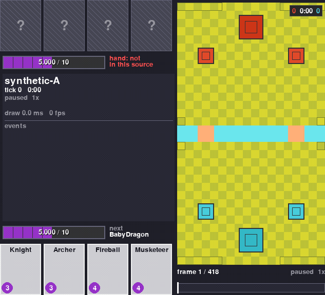
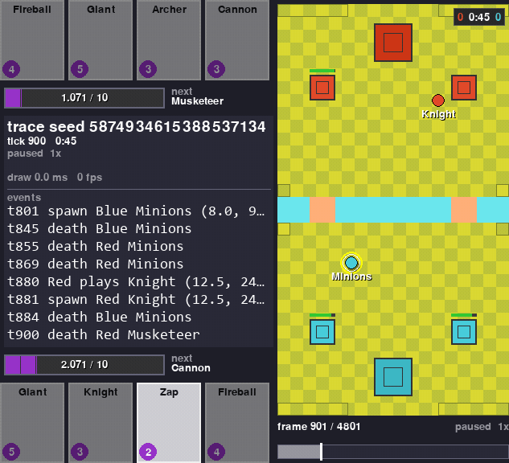
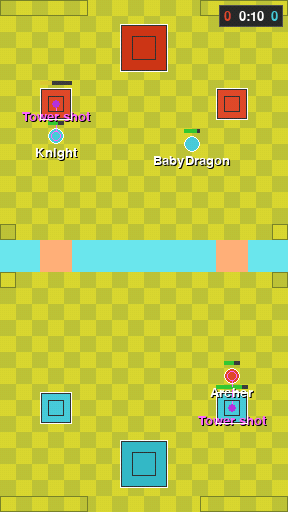
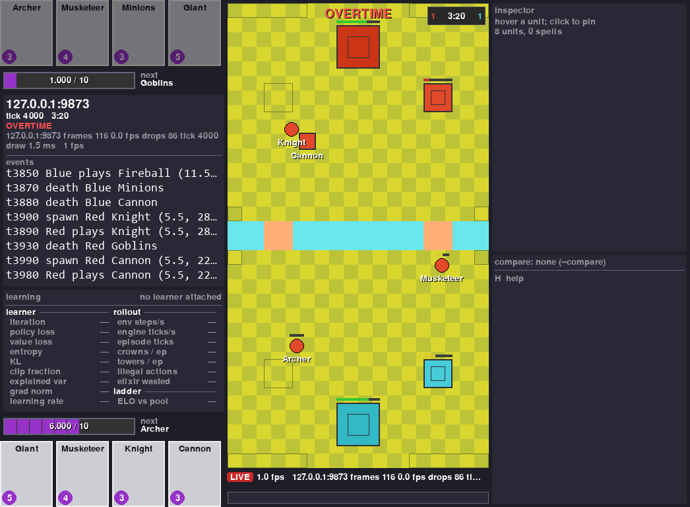

# RoyaleViser

<p align="center">
  
  
  <a href="docs/"></a>
  <a href="https://discord.gg/4D2BS5JBHP"></a>
  
</p>

**Watch a Clash Royale battle play out, one step at a time, in a window on your own machine.**

It opens three kinds of thing: a recording of a real match, a battle saved to a file by the
engine, or a bot that is training right now in another program.

<p align="center">
  <a href="#try-it"><b>Try it</b></a>
  &nbsp;&middot;&nbsp; <a href="#what-it-does">What it does</a>
  &nbsp;&middot;&nbsp; <a href="#save-a-picture-or-a-clip">Save a picture</a>
  &nbsp;&middot;&nbsp; <a href="#with-the-rest-of-the-stack">The rest of the stack</a>
  &nbsp;&middot;&nbsp; <a href="#status-2026-09-22">Status</a>
  &nbsp;&middot;&nbsp; <a href="#community">Community</a>
</p>

You can try this one without building the engine: clone it, install one package, run one
command. You do not need any game files either. [Jump to Try it](#try-it).

<p align="center"></p>

That is a battle the engine played against itself, saved to a file and reopened here. On the
left you get both players' hands, their elixir to a thousandth, the next card and a running log
of what happened. On the right you get every single thing the file knows about the Blue Valkyrie
that was clicked. The bar underneath scrubs through the replay.

The point of the viewer is simple. You can see what your bot did instead of guessing it from
numbers, and you can see where the engine and the real game disagree instead of reading it off a
table.

It draws one picture per *tick*. A tick is the game's own 50 ms step, so 20 of them go by every
second.

It always runs as its own separate program. Your training run never waits for it. When nobody is
watching, it costs your training run almost nothing.

## Try it

Two recordings of the same scripted battle, one from each player's point of view, are committed
with the tests. They are about 20 KB each, so they came down with your clone.

You need the shared virtual environment from [Setup](#setup) and this one package installed.
Nothing else. No engine build, no game files, no recordings of your own. Then, from the repo
folder:

```
..\.venv\Scripts\python -m royaleviser tests\fixtures\frames-synthetic-A.jsonl.gz --compare tests\fixtures\frames-synthetic-B.jsonl.gz --speed 4 --seconds 8
```

A window opens and plays the battle at 4x speed.

The second recording is drawn on top of the first as hollow ghosts. Nothing differs between
these two recordings, so the ghosts sit exactly on the units and never step off. The compare
panel finishes at `395 ticks compared, 0 differ`, under a `GAME OVER  Blue wins` banner.

That battle is a script, not something the engine played. One frame of the recording stands for
six ticks of the script, so the units move at six times their scripted speed. It is an honest
look at the window and a poor look at how the engine plays.

After eight seconds the program closes itself and prints how long each picture took to draw
(2026-09-21):

```
royaleviser: 290 draws, mean 4.08 ms, max 370.22 ms
```

That is 290 pictures at 4.08 ms each on average. A replay needs 20 a second, so there is a lot of
room to spare. The 370 ms is the very first draw, which builds the board and loads the fonts.

Drop `--seconds` and the window stays open until you close it. The same command opens the other
kinds of source:

```
python -m royaleviser frames-demo-20260920-120752-A.jsonl.gz       # a recording of a real battle
python -m royaleviser battle.msgpack --start-tick 900              # a trace saved from the engine
python -m royaleviser --stream 127.0.0.1:9870                      # an environment running right now
```

Keys in the window: space plays and pauses. The arrow keys step one frame. A click pins a unit,
or seeks the timeline if you click the bar. `c` turns the compare ghost on and off. `s` saves a
PNG. `h` lists every key there is.

Set `SDL_VIDEODRIVER=dummy` and no window opens at all. `--seconds` and `--shot` keep working,
so that is how you drive the viewer on a machine with no screen.

The seat, the window size, `--seconds`, `--shot` and the rest of the command line are in
[`docs/internals.md`](docs/internals.md).

## What it does

<table>
  <tr>
    <td width="33%" align="center"><br><b>Replay a recorded match</b><br><sub>Play, pause, step one frame, seek by clicking the bar. The clip is the scripted battle that ships with the tests, so its motion is scripted rather than played by the engine.</sub></td>
    <td width="33%" align="center"><br><b>Open an engine trace</b><br><sub>A battle saved from the engine with one frame per tick. Open it at any tick you like.</sub></td>
    <td width="33%" align="center"><br><b>Watch a training run live</b><br><sub>Attach to a training run in another program. With nobody watching it costs that run 193 ns a step (2026-09-21).</sub></td>
  </tr>
  <tr>
    <td width="33%" align="center"><br><b>Compare two recordings of one battle</b><br><sub>Both players recorded one real match: 2407 ticks compared, 3 differ (2026-09-21), each for a single frame.</sub></td>
    <td width="33%" align="center"><br><b>See where they disagree</b><br><sub>The second source is drawn as hollow ghosts on the first. On a tick where they differ, the ghost steps off the unit. The two recordings in this clip are identical, so nothing steps off here.</sub></td>
    <td width="33%" align="center"><br><b>Inspect any unit</b><br><sub>Click a unit to list every field the source carries, raw and unrounded.</sub></td>
  </tr>
  <tr>
    <td width="33%" align="center"><br><b>Follow the event log</b><br><sub>Plays, spawns, deaths and tunnel trips (Miner, Goblin Drill), each with its tick and tile, newest last.</sub></td>
    <td width="33%" align="center"><br><b>Paths and target lines</b><br><sub>Recorded units carry the route they walk and the thing they attack. Two keys draw both on the board.</sub></td>
    <td width="33%" align="center"><br><b>Render with no display</b><br><sub>Save the window as a PNG with no screen. A scripted battle ships with the tests, so nothing else is needed.</sub></td>
  </tr>
</table>

## Save a picture or a clip

<p align="center">
  
  
  
</p>

You can take a picture of any of this for your own write-up. `capture` writes what the window
would show straight to a file, with no window, no display and no clock. It is what made the
images on this page.

```python
from royaleviser.capture import capture
from royaleviser.sources import open_source

capture(open_source("battle.msgpack"), "shot.png", ticks=(900, 901, 1), scale=24, crop="left")
```

The whole signature:

    capture(source, out, *, ticks=None, scale=24, view=None, crop="full", fps=20,
            compare=None, theme=DEFAULT, live_timing=False) -> list[Path]

- The suffix picks the format. `.png` writes one file per frame, numbered `name-0000.png` when
  the range holds more than one. `.mp4` and `.gif` encode the range at `fps`.
- `ticks` is `(start, stop, step)` in battle ticks, the clock the window shows, not frame
  indices. Without it the whole source is captured.
- `crop` is `full`, `board`, `left`, or a rectangle. `left` drops the inspector column.
- `compare` ghosts a second source at the same tick. `view` carries the seat, the overlays and
  `hover_uid`, which pins a unit in the inspector.
- The same source and the same arguments give you the same bytes, always. The two numbers that
  move with the wall clock — the draw time and the frame rate — are zero in every capture, and
  the LIVE pill is never drawn: a capture replays a file. `live_timing=True` adds the source's
  own status line, which is built from the file, so it is reproducible too.
- PNG needs nothing extra. mp4 and gif are encoded by ffmpeg, which comes with the optional
  `media` extra.

For a sense of size: a whole scripted battle cropped to `left` at scale 16, every 8th tick, is a
1.03 MB gif.

## With the rest of the stack

<p align="center"></p>

<p align="center">
  <a href="https://github.com/RoyaleGym/RoyaleSim"></a>
  <a href="https://github.com/RoyaleGym/RoyaleGym"></a>
  <a href="https://github.com/RoyaleGym/RoyaleLearn"></a>
  
</p>

| Repo | What it is | To the viewer |
|---|---|---|
| [RoyaleSim](https://github.com/RoyaleGym/RoyaleSim) | the battle engine, written in Rust. It uses whole numbers only, and the same battle always plays out the same way. Its movement is measured against recordings of real battles | every trace and every stream starts here. The compare view is how you look at where it differs from the real game |
| [RoyaleGym](https://github.com/RoyaleGym/RoyaleGym) | the layer your bot plugs into: what it sees, what it can do, what it gets rewarded for. Gymnasium, PettingZoo and self-play flavours | the only sibling this package imports. It gives the viewer the trace format (`royalegym.replay`), the engine-side sender (`royalegym.viser.ViserPublisher`, a *publisher* in the code) and the shape of the arena |
| [RoyaleLearn](https://github.com/RoyaleGym/RoyaleLearn) | the training side: bots playing themselves, PPO (a common training algorithm), a ladder of frozen past opponents, saved checkpoints | a training run streams to the viewer like any other environment |
| **RoyaleViser** (this repo) | the viewer: recordings, engine traces and running environments, in its own window | the window |
| RoyaleLive | private. It records real battles | it writes the recordings the viewer replays and compares |

If you already know RLGym, RocketSim and rlviser, this is the same split. An environment API on
top of an engine, a learner on top of that, and the viewer off in its own process.

**What goes in.** Three things.

- A **recording** of a real battle: `frames-*.jsonl` or `.jsonl.gz`, one line of JSON per frame,
  20 frames a second.
- A **trace** saved from the engine: `.msgpack` or `.json`, written by
  `royalegym.replay.ReplayRecorder`.
- A **stream** from a program running right now: UDP datagrams from a `ViserPublisher`, one per
  environment step.

**What comes out.** PNG stills and mp4 or gif clips, the compare totals, and one frame object
(`royaleviser.model.Frame`) that any other front end can draw from.

The three formats, the rules every frame has to follow and the stream protocol are in
[`docs/internals.md`](docs/internals.md).

### Saving a battle to a file

Save a battle from the engine and you can reopen it here later, at any tick. RoyaleGym's
`ReplayRecorder` writes the file. Pass it `frame_every_tick=True` and it keeps every single
engine tick instead of one frame per environment step:

```python
import numpy as np
from royalegym import (ClashParallelEnv, RandomLegalOpponent, ReplayRecorder,
                       RustEngine, StepLimitCondition, save_trace)

rec = ReplayRecorder(frame_every_tick=True)
env = ClashParallelEnv(RustEngine(),          # RustEngine: the RoyaleSim engine, from Python
                       recorder=rec, truncation_cond=StepLimitCondition(200))
obs, _ = env.reset(seed=2026)
rng, opp = np.random.default_rng(0), RandomLegalOpponent(noop_prob=0.3)
while env.agents:
    obs, *_ = env.step({a: opp.act(obs[a], obs[a]["action_mask"], rng) for a in env.agents})
save_trace(rec.trace, "battle.msgpack")      # 200 steps -> 2001 frames, one per tick
```

200 steps of the environment turn into 2001 frames, one per tick.

### Watching a run that is happening now

A running environment sends frames out instead of writing a file. Set one environment variable
and change no code, or hand it a sender yourself. Then attach from another program.

Nothing is sent until a viewer says hello. Sending stops three seconds after the last viewer goes
away. So you can leave this switched on in a training run you are not watching.

```
set ROYALEVISER=127.0.0.1:9870                                  # before the training run starts
env = ClashSelfPlayVecEnv(8)                                    # binds one publisher, watches game 0
python -m royaleviser --stream 127.0.0.1:9870                   # in another process
```

A viewer shows one battle at a time. When you run eight games at once, something has to pick
which one. So the vectorised environment is the thing that reads `ROYALEVISER`: it opens the
sender once and hands it to game 0. Eight games all reaching for the viewer's one UDP port is an
error, not eight streams.

A single environment reads no environment variable of its own. You hand it a sender directly:

```
env = ClashParallelEnv(RustEngine(), viser=ViserPublisher())   # from royalegym.viser; 127.0.0.1:9870
```

While a viewer is attached, one msgpack datagram goes out per step. Measured: 2.6 KB for 18 units
(12 troops and the 6 towers, which are units of their own kind, not a list beside them), and
11 KB for 60.

<p align="center"></p>

That is a real stream, not the scripted battle. Another process is stepping four self-play
battles on the engine and publishing game 0, and everything in the window arrived over the
socket. Two things in it are worth reading. The learner panel is empty because nothing is training:
that is today's honest picture and it is the gap listed below. (The shot predates the panel
naming the port it listens on, which is what an empty one says now.) And the status line
admits 86 dropped frames out of 116, which is what a busy machine looks like. Four other jobs were running when this was taken. The viewer drops frames rather than
slowing the environment down, which is the trade it is built to make.

### Showing your training numbers next to the battle

The learner can report too, on its own port, and the panel in the dashboard fills in:

```python
from royaleviser.model import Learning
from royaleviser.sources import LearningPublisher

learner = LearningPublisher()                     # 127.0.0.1:9871, the stream's port plus one
for it in range(iterations):
    ...                                           # rollout, then optimise
    learner.publish(Learning(run="ppo-0007", iteration=it, policy_loss=0.0241, elo=1183))
```

<p align="center"></p>

That is the same window on a live battle. The panel under the event log is the learner's, and
every number in it arrived over the network.

It is sent separately from the battle frames and on its own clock, once per training iteration
rather than once per step. So it keeps updating while the learner is busy and nothing on the
board is moving. A viewer that attaches in the middle of a run is sent the last status right
away, instead of waiting for the next iteration.

One message is the whole status. That is the contract, not a matter of taste: the viewer replaces
what it is holding rather than merging the new message into the old one, so the panel never shows
a mixture the learner never sent at one moment.

A field your learner does not send shows a dash. The panel never puts a zero there. Nobody
reported that number, so it does not pretend one.

Anything the twenty fixed rows cannot hold goes in `Learning.extra`, which is `{name: number or
string}`, drawn underneath in the order you sent it.

If you would rather your learner did not import this package, it can send the same small msgpack
datagram itself. The format and the six constants it has to match are in
[`docs/internals.md`](docs/internals.md).

### Setup

The whole stack shares one setup. Clone the repos side by side into one folder, with one virtual
environment at its root.

```
mkdir Royale && cd Royale
git clone https://github.com/RoyaleGym/RoyaleSim.git
git clone https://github.com/RoyaleGym/RoyaleGym.git
git clone https://github.com/RoyaleGym/RoyaleViser.git
git clone https://github.com/RoyaleGym/RoyaleLearn.git
python -m venv .venv                                                    # Python 3.12
.venv\Scripts\python -m pip install maturin pytest hypothesis ruff
cd RoyaleSim && ..\.venv\Scripts\python tools\extract_arena.py && ..\.venv\Scripts\python tools\extract_cards.py --vintage 2018 && ..\.venv\Scripts\python tools\extract_cards.py --vintage 2018 --out data\derived\cards.json && ..\.venv\Scripts\python tools\extract_globals.py && cd ..   # generates RoyaleSim/data/derived/
cd RoyaleSim && ..\.venv\Scripts\maturin develop --release && cd ..     # builds the engine into the venv. Give it a few minutes and some free memory.
.venv\Scripts\python -m pip install -e RoyaleGym
.venv\Scripts\python -m pip install -e RoyaleViser
.venv\Scripts\python -m pip install -e RoyaleLearn
.venv\Scripts\python -m pip install -e "RoyaleLearn[torch]"   # only if you want to train; it is a big download
```

You do not need all of that to use the viewer.

- **Recordings, streams and the scripted battle** need only the virtual environment and
  `pip install -e RoyaleViser`. That pulls in pygame, msgspec and numpy. Without RoyaleGym the
  board is drawn from a copy of the arena built into this package.
- **Opening a trace** needs RoyaleGym as well. RoyaleGym then reads the arena out of the
  RoyaleSim checkout (`data/derived/`, which the `extract_*` line above generates), not out of
  the engine build.
- **Recording a trace yourself** needs the engine build too, so you need the whole recipe.
- **mp4 and gif out of `capture`** need the `media` extra, which brings ffmpeg with it. A PNG
  needs nothing beyond this package.

## Status (2026-09-22)

<p align="center">
  
  
  
</p>

Working end to end:

- Replaying a recording, and comparing two recordings of one battle. 2407 ticks compared, 3
  differ.
- Traces from the engine. A 2001-frame self-play trace draws, and every frame of it passes the
  viewer's own consistency check.
- Streaming from a running environment. 360 environment steps, 329 frames sent, 0 dropped.
- The learning panel filled from a live stream. The status goes on its own port, whole in one
  message, and is re-sent to a viewer that attaches in the middle of a run
  (`docs/viewer-learning.png`).
- Saving a picture or a clip to a file with no window, no display and no clock.
- Every draw redraws the whole window and takes 2-5 ms at 24 pixels per tile. A replay needs 20
  a second, so that is far inside budget. That is why the viewer is Python and pygame and not a
  Rust program.

**Known gaps.** Every one of these is a source not carrying the information. None of them is the
window refusing to draw something.

- A stream carries one frame per environment step, which is 10 ticks at the default settings, not
  one frame per tick. If you want every tick, record a trace with `frame_every_tick=True` and
  open that instead.
- No training run has filled the learning panel yet. The path is tested end to end and the
  screenshot above is a real live stream, but the numbers in it come from `tests/run_stream.py`,
  which stands in for a learner. What is proven is the road, not the traffic.
- A recording gives no unit a radius and no flying flag. So every unit is drawn at one default
  size, and air units look like ground units.
- A trace or a stream gives no unit a path and no target. So the path and target overlays draw
  nothing for them.
- Spells in a recording come through as projectiles, plus the few whose effect is tagged with its
  card (Fireball, Arrows, Rocket, Log, Barbarian Barrel). There are no rage, poison or freeze
  zones.
- A recording holds only the recording player's hand. The opponent's shows as "hand: not in this
  source" until the results screen. A trace's cycle past the revealed cards shows as "next ?".

Tests:

```
cd RoyaleViser && ..\.venv\Scripts\python -m pytest -q        # 94 passed, 3 skipped in a fresh clone (2026-09-22)
..\.venv\Scripts\python -m ruff check royaleviser tests
```

The three skips are the tests that need a recording of a real battle, and the repo does not ship
one. The run names them out loud so nobody mistakes a skip for a pass. With those recordings
present the result is 97 passed. Without the `media` extra (`imageio-ffmpeg`, which
`royaleviser.capture` needs only for mp4 and gif) two more tests skip.

Read next: [`docs/internals.md`](docs/internals.md) for the frame model, the recording format,
the stream protocol, the command line, the layout, the tests and the performance table;
[RoyaleGym](https://github.com/RoyaleGym/RoyaleGym) for the trace format and the sender that
streams to the viewer; [RoyaleSim](https://github.com/RoyaleGym/RoyaleSim) for the engine the
traces come from.

## Community

Viewer feedback, recording formats and rendering work happen in the project's Discord:
[**https://discord.gg/4D2BS5JBHP**](https://discord.gg/4D2BS5JBHP)

Issues and pull requests on this repo are welcome too.
