# RoyaleViser

**The window for the Royale stack**: watch a Clash Royale battle tick by tick, whether it is a
recorded real match, a battle saved from the engine, or a bot training right now.

<p align="center">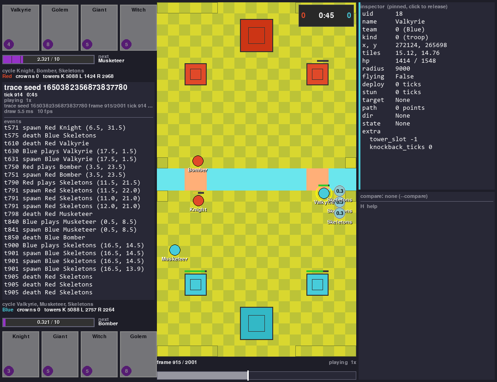</p>

A self-play battle on RoyaleSim, the stack's battle engine, saved to a file and reopened
here. Left: both hands, elixir to a thousandth, the next card and the event log. Right:
everything the file knows about the clicked Blue Valkyrie. The bar below seeks the replay.

RoyaleViser exists so that what a bot does, and where the engine differs from the real game,
can be seen instead of guessed from numbers. It draws one frame per *tick*, the game's 50 ms
step (20 a second), from three kinds of source: a **recording** of a real battle, a **trace**
saved from the engine by RoyaleGym, or a **stream** from a training environment stepping in
another process. It is always a separate process: the environment never waits for it, and
when nobody is watching it costs the environment nothing.

## What it does

<table>
  <tr>
    <td width="33%" align="center"><br><b>Replay a recorded match</b><br><sub>A real battle recorded at 20 frames a second: play, pause, step one frame, seek by clicking the bar.</sub></td>
    <td width="33%" align="center">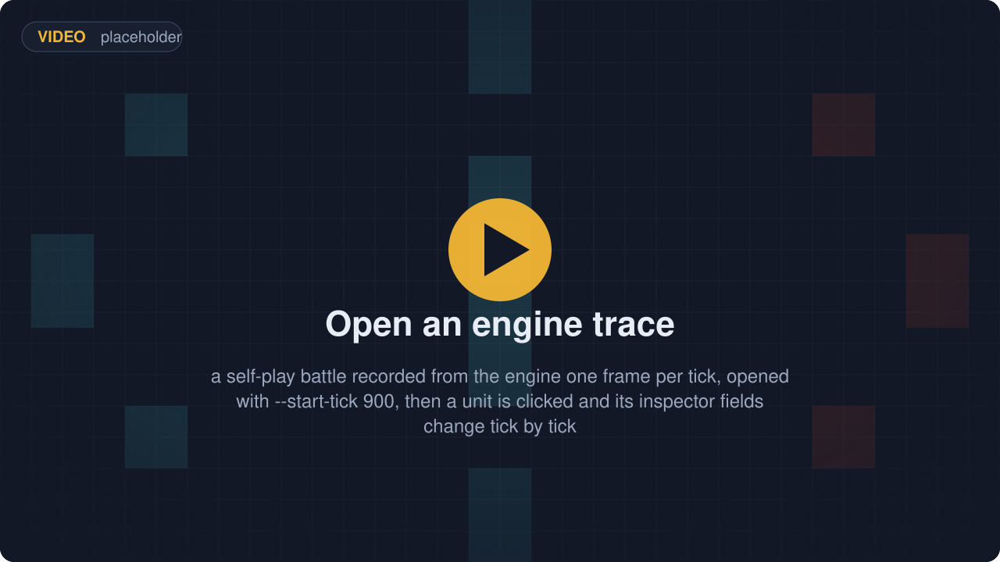<br><b>Open an engine trace</b><br><sub>A battle saved from the engine with one frame per tick; open it at any tick.</sub></td>
    <td width="33%" align="center">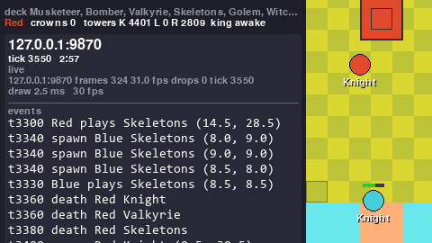<br><b>Watch a training run live</b><br><sub>Attach to an environment stepping in another process; unwatched, it pays 193 ns a step (2026-09-21).</sub></td>
  </tr>
  <tr>
    <td width="33%" align="center">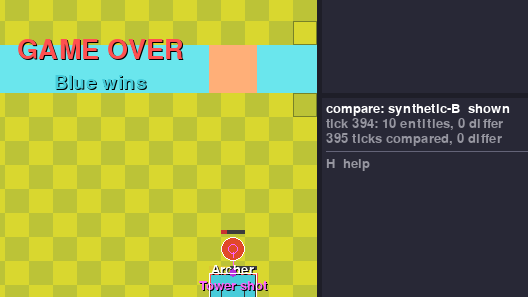<br><b>Compare two recordings of one battle</b><br><sub>Both players recorded one match: 2407 ticks compared, 3 differ (2026-09-21), each for a single frame.</sub></td>
    <td width="33%" align="center">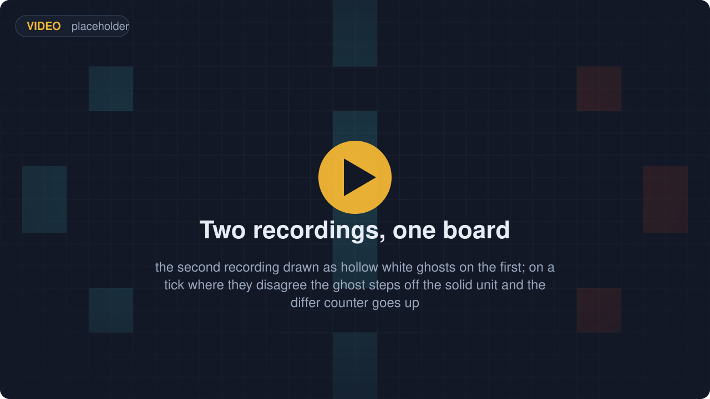<br><b>See where they disagree</b><br><sub>The second source is drawn as hollow ghosts on the first; on a differing tick the ghost steps off the unit.</sub></td>
    <td width="33%" align="center">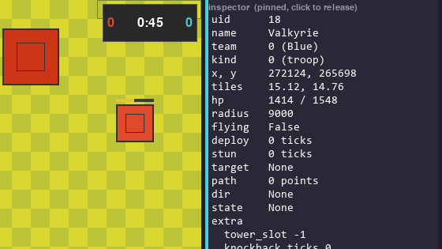<br><b>Inspect any unit</b><br><sub>Click a unit to list every field the source carries, raw and unrounded.</sub></td>
  </tr>
  <tr>
    <td width="33%" align="center">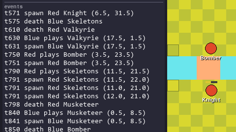<br><b>Follow the event log</b><br><sub>Plays, spawns, deaths and tunnel trips (Miner, Goblin Drill), each with its tick and tile, newest last.</sub></td>
    <td width="33%" align="center">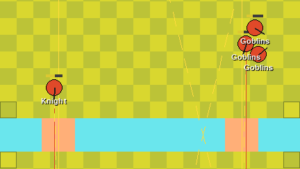<br><b>Paths and target lines</b><br><sub>Recorded units carry the route they walk and the thing they attack; two keys draw both on the board.</sub></td>
    <td width="33%" align="center">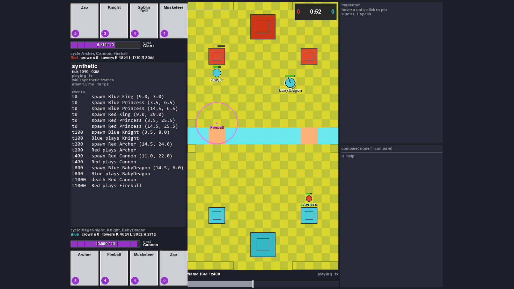<br><b>Render with no display</b><br><sub>Save the window as a PNG with no screen; a scripted battle ships with the tests, so nothing else is needed.</sub></td>
  </tr>
</table>

## Try it

Two recordings of one scripted battle, one per player, are committed with the tests (20 KB
each). From the repo folder, with the shared venv from [Setup](#with-the-rest-of-the-stack)
and only this package installed:

```
..\.venv\Scripts\python -m royaleviser tests\fixtures\frames-synthetic-A.jsonl.gz --compare tests\fixtures\frames-synthetic-B.jsonl.gz --speed 4 --seconds 8
```

The window opens at 4x with the second recording drawn on the first as hollow ghosts, which
sit exactly on the units because nothing differs; the compare panel ends at `395 ticks
compared, 0 differ` under a `GAME OVER  Blue wins` banner, and after eight seconds the
process closes and prints what every draw cost (2026-09-21):

```
royaleviser: 290 draws, mean 4.08 ms, max 370.22 ms
```

Drop `--seconds` to keep the window open. The same command opens real battles:

```
python -m royaleviser frames-demo-20260920-120752-A.jsonl.gz       # a recording of a real battle
python -m royaleviser battle.msgpack --start-tick 900              # a trace saved from the engine
python -m royaleviser --stream 127.0.0.1:9870                      # an environment running right now
```

In the window: space plays and pauses, the arrow keys step one frame, a click pins a unit or
seeks the timeline, `c` toggles the compare ghost, `s` saves a PNG and `h` lists every key.
With `SDL_VIDEODRIVER=dummy` no window opens at all, which is how the images on this page were
made. The seat, the window geometry, `--seconds`, `--shot` and the rest of the command line are
in [`docs/internals.md`](docs/internals.md).

## With the rest of the stack

<p align="center">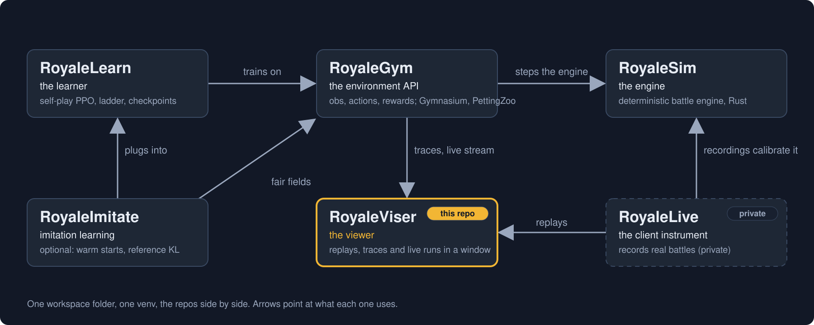</p>

| Repo | What it is | To the viewer |
|---|---|---|
| [RoyaleSim](https://github.com/RoyaleGym/RoyaleSim) | the battle engine: deterministic, integer-only Rust, its movement rules measured against recordings of real battles | every trace and stream comes from it; the compare view is how its differences from the real game are looked at |
| [RoyaleGym](https://github.com/RoyaleGym/RoyaleGym) | the environment API: observations, actions, rewards; Gymnasium, PettingZoo and self-play envs | the only sibling this package imports: the trace format (`royalegym.replay`), the engine-side publisher (`royalegym.viser.ViserPublisher`) and the arena geometry |
| [RoyaleLearn](https://github.com/RoyaleGym/RoyaleLearn) | the training harness: self-play rollouts, PPO, a ladder of frozen opponents, checkpoints | a training run streams to the viewer like any environment |
| **RoyaleViser** (this repo) | the viewer: recordings, engine traces and running environments in its own window | the window |
| RoyaleLive | the private client instrument that records real battles | writes the recordings the viewer replays and compares |

If you know RLGym, RocketSim and rlviser: it is the same split, an environment API over an
engine with a learner on top and the viewer in its own process.

**In**: recordings (`frames-*.jsonl` or `.jsonl.gz`, one JSON line per frame at 20 a second),
traces (`.msgpack` or `.json`, written by `royalegym.replay.ReplayRecorder`) and streams (UDP
datagrams from a `ViserPublisher`, one frame per environment step). **Out**: PNG shots, the
compare totals, and one frame model (`royaleviser.model.Frame`) that any other front end can
draw from. The three formats, the rules every frame follows and the stream protocol are in
[`docs/internals.md`](docs/internals.md).

A trace is recorded by RoyaleGym's `ReplayRecorder`; with `frame_every_tick=True` it keeps
every engine tick, not only one frame per environment step:

```python
import numpy as np
from royalegym import (ClashParallelEnv, RandomLegalOpponent, ReplayRecorder,
                       RustEngine, StepLimitCondition, save_trace)

rec = ReplayRecorder(frame_every_tick=True)
env = ClashParallelEnv(RustEngine(),          # RustEngine: the RoyaleSim engine, from Python
                       recorder=rec, truncation_cond=StepLimitCondition(200))
obs, _ = env.reset(seed=2026)
rng, opp = np.random.default_rng(0), RandomLegalOpponent(noop_prob=0.3)
while env.agents:
    obs, *_ = env.step({a: opp.act(obs[a], obs[a]["action_mask"], rng) for a in env.agents})
save_trace(rec.trace, "battle.msgpack")      # 200 steps -> 2001 frames, one per tick
```

A running environment streams instead of recording: set one environment variable and change no
code, or hand it a publisher, then attach from another process. The environment sends nothing
until a viewer says hello, and stops three seconds after the last viewer goes away.

```
set ROYALEVISER=127.0.0.1:9870                                  # before the training run starts
env = ClashSelfPlayVecEnv(8)                                    # binds one publisher, watches game 0
python -m royaleviser --stream 127.0.0.1:9870                   # in another process
```

A viewer watches one battle, so the vectorised environment is where that is decided: it binds
the publisher once and hands it to game 0, because eight games each reaching for the viewer's
one UDP port is an error rather than eight streams. A single environment is handed one
explicitly and reads no environment variable of its own:

```
env = ClashParallelEnv(RustEngine(), viser=ViserPublisher())   # from royalegym.viser; 127.0.0.1:9870
```

<p align="center">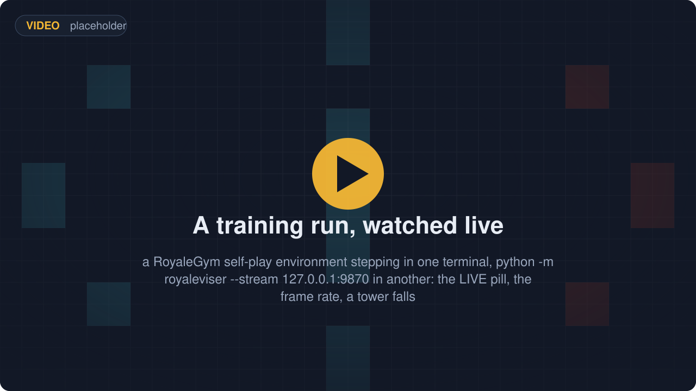</p>

The learner can report too, on its own port, and the dashboard's learning panel fills in:

```python
from royaleviser.model import Learning
from royaleviser.sources import LearningPublisher

learner = LearningPublisher()                     # 127.0.0.1:9871, the stream's port plus one
for it in range(iterations):
    ...                                           # rollout, then optimise
    learner.publish(Learning(run="ppo-0007", iteration=it, policy_loss=0.0241, elo=1183))
```

<p align="center">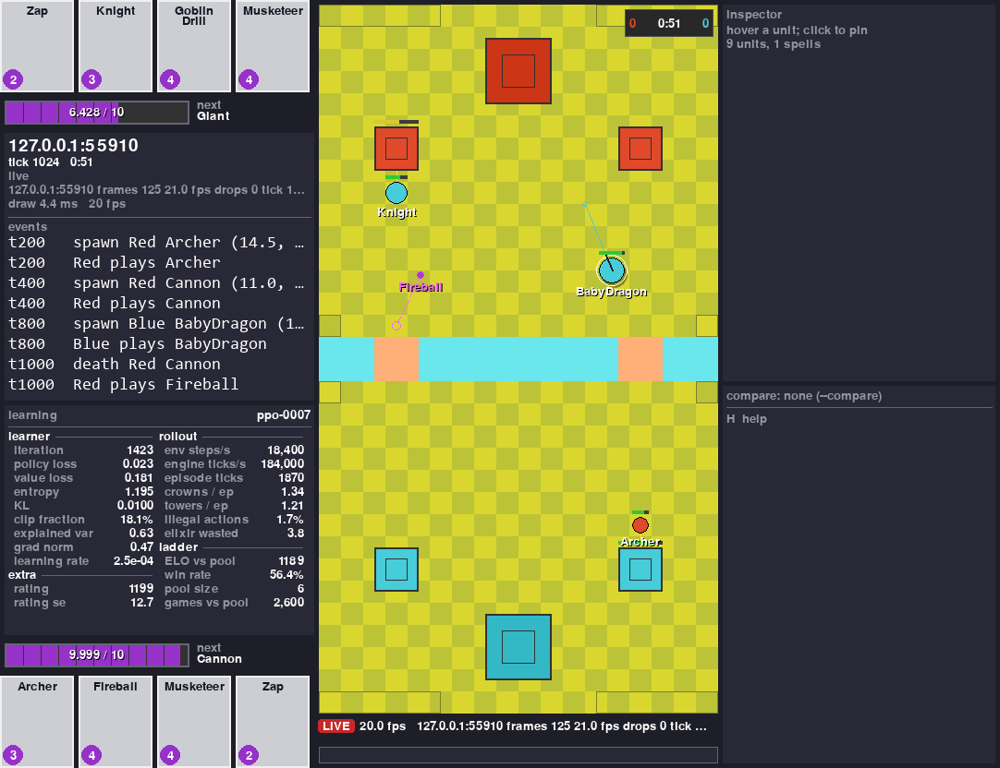</p>

The same window, attached to a stream: the panel under the event log is the learner's, and
every number in it came off the socket. It is a separate message on a separate clock, sent
once per iteration rather than once per step, so it keeps arriving while the environment is
between rollouts and nothing on the board moves, and a viewer that attaches mid-run is sent
the last status instead of waiting for the next iteration. A field the learner does not send
stays an em dash — the panel never invents a zero for a number nobody reported. Anything the
twenty fixed rows cannot hold goes in `Learning.extra`, `{name: number or string}`, drawn
underneath in the order it was sent. A learner that would rather not import this package sends
the same small msgpack datagram itself; the format and the five constants it has to match are
in [`docs/internals.md`](docs/internals.md).

Setup, shared by the whole stack: the repos are cloned side by side into one folder with one
venv at its root.

```
mkdir Royale && cd Royale
git clone https://github.com/RoyaleGym/RoyaleSim.git
git clone https://github.com/RoyaleGym/RoyaleGym.git
git clone https://github.com/RoyaleGym/RoyaleViser.git
git clone https://github.com/RoyaleGym/RoyaleLearn.git
python -m venv .venv                                                    # Python 3.12
.venv\Scripts\python -m pip install maturin pytest hypothesis ruff
cd RoyaleSim && ..\.venv\Scripts\python tools\extract_arena.py && ..\.venv\Scripts\python tools\extract_cards.py && ..\.venv\Scripts\python tools\extract_globals.py && cd ..   # generates RoyaleSim/data/derived/
cd RoyaleSim && ..\.venv\Scripts\maturin develop --release && cd ..     # builds the engine into the venv (~1 min, ~1.5 GB RAM)
.venv\Scripts\python -m pip install -e RoyaleGym
.venv\Scripts\python -m pip install -e RoyaleViser
.venv\Scripts\python -m pip install -e RoyaleLearn
```

Recordings, streams and the scripted battle need only the venv and `pip install -e RoyaleViser`
(pygame, msgspec, numpy); without RoyaleGym the board comes from a built-in copy of the arena.
Opening a trace needs RoyaleGym, which then reads the arena from the RoyaleSim checkout
(`data/derived/`, the `extract_*` line), not the engine build; recording a trace yourself needs
the build too.

## Status (2026-09-21)

Working end to end:

- Replaying a recording, and comparing two recordings of one battle (2407 ticks compared, 3
  differ).
- Traces from the engine: a 2001-frame self-play trace draws with every frame passing the
  viewer's own consistency check.
- Streaming from a running environment: 360 environment steps, 329 frames sent, 0 dropped.
- The learning panel filled from a live stream: a status on its own port, whole per message,
  re-sent to a viewer that attaches mid-run (`docs/viewer-learning.png`).
- Every draw is a full repaint and costs 2-5 ms at 24 px per tile, far inside the 20 frames a
  second a replay needs, which is why the viewer is Python and pygame rather than a Rust
  process.

Known gaps, all of them things a source does not carry rather than things the window will not
draw:

- A stream carries one frame per environment step (10 ticks at the defaults), not one per
  tick; for a per-tick view, record a trace with `frame_every_tick=True` and open that.
- No training run has filled the learning panel yet. The path is tested end to end and the
  screenshot above is a real stream, but the status in it comes from `tests/run_stream.py`,
  which stands in for the learner: what is proven is the road, not the traffic.
- A recording gives no unit a radius or a flying flag, so every unit is drawn at one default
  size and air units look like ground units.
- A trace or stream gives no unit a path or a target, so the path and target overlays draw nothing for them.
- Spells in a recording are projectiles and the few whose effect is tagged with its card
  (Fireball, Arrows, Rocket, Log, Barbarian Barrel); there are no rage, poison or freeze zones.
- A recording holds only the recording player's hand: the opponent's shows as "hand: not in
  this source" until the results screen. A trace's cycle beyond the revealed cards shows as
  "next ?".

Tests:

```
cd RoyaleViser && ..\.venv\Scripts\python -m pytest -q        # 87 passed, 3 skipped as of 2026-09-22
..\.venv\Scripts\python -m ruff check royaleviser tests
```

The three skips are the tests that need a recording of a real battle, which the repo does not
ship; the run names them so they are not mistaken for passes. With the recordings present the
result is 90 passed. Without the `media` extra (`imageio-ffmpeg`, which `royaleviser.capture`
needs only for mp4 and gif) two more tests skip.

Read next: [`docs/internals.md`](docs/internals.md) for the frame model, the recording format,
the stream protocol, the command line, the layout, the tests and the performance table;
[RoyaleGym](https://github.com/RoyaleGym/RoyaleGym) for the trace format and the publisher;
[RoyaleSim](https://github.com/RoyaleGym/RoyaleSim) for the engine the traces come from.

## Community

Viewer feedback, recording formats and rendering work happen in the project's Discord:
[**https://discord.gg/4D2BS5JBHP**](https://discord.gg/4D2BS5JBHP)

Issues and pull requests on this repo are welcome too.
