# RoyaleViser

<p align="center">
  
  
  <a href="docs/"></a>
  <a href="https://discord.gg/4D2BS5JBHP"></a>
  
</p>

**Watch a Clash Royale battle play out, one step at a time, in a window on your own machine.**

It opens three kinds of thing: a recording of a real match, a battle saved to a file by the
engine, or a bot that is training right now in another program.

<p align="center">
  <a href="#try-it"><b>Try it</b></a>
  &nbsp;&middot;&nbsp; <a href="#what-it-does">What it does</a>
  &nbsp;&middot;&nbsp; <a href="#save-a-picture-or-a-clip">Save a picture</a>
  &nbsp;&middot;&nbsp; <a href="#with-the-rest-of-the-stack">The rest of the stack</a>
  &nbsp;&middot;&nbsp; <a href="#status">Status</a>
  &nbsp;&middot;&nbsp; <a href="#community">Community</a>
</p>

You can try this one without building the engine: clone it, install one package, run one
command. You do not need any game files either. [Jump to Try it](#try-it).

Every command on this page is for **Windows PowerShell**, one per line. Paste them one at a time
rather than as a block. PowerShell cannot chain commands with `&&`, and a pasted `#` comment is
not a comment in `cmd`. On macOS and Linux the interpreter is `.venv/bin/python`, paths use
forward slashes, `cp` replaces `Copy-Item`, and `export X=Y` sets a variable. Where a line differs
in any other way, its macOS and Linux form is given beside it.

<p align="center">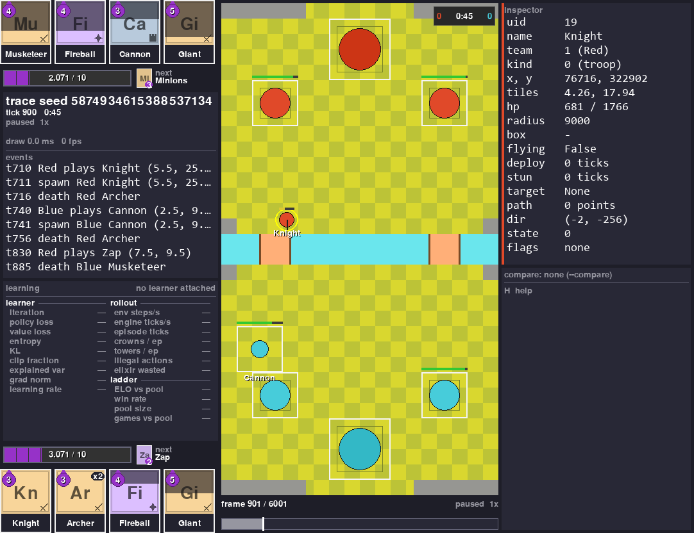</p>

That is a battle the engine played against itself, saved to a file and reopened here. On the
left you get both players' hands, their elixir to a thousandth, the next card and a running log
of what happened. On the right you get every single thing the file knows about the Blue Valkyrie
that was clicked. The bar underneath scrubs through the replay.

The point of the viewer is simple. You can see what your bot did instead of guessing it from
numbers. And you can lay two sources of one battle over each other and see the ticks where they
disagree.

It draws one picture per *tick*. A tick is the game's own 50 ms step, so 20 of them go by every
second.

It always runs as its own separate program. Your training run never waits for it. When nobody is
watching, it costs your training run almost nothing.

## Try it

Two recordings of the same scripted battle, one from each player's point of view, are committed
with the tests. They are about 20 KB each, so they came down with your clone.

You need the shared virtual environment from [Setup](#setup) and this one package installed.
Nothing else. No engine build, no game files, no recordings of your own. Then move into the
`RoyaleViser` folder with `cd RoyaleViser` and run this one command:

```
..\.venv\Scripts\python -m royaleviser tests\fixtures\frames-synthetic-A.jsonl.gz --compare tests\fixtures\frames-synthetic-B.jsonl.gz --speed 4 --seconds 8
```

A window opens and plays the battle at 4x speed. On a computer with no screen, such as a Linux
server, no window appears and nothing tells you so. The end of this section shows how to run it
there.

The second recording is drawn on top of the first as hollow ghosts. Nothing differs between
these two recordings, so the ghosts sit exactly on the units and never step off. The compare
panel finishes at `395 ticks compared, 0 differ`, under a `GAME OVER  Blue wins` banner.

That battle is a script, not something the engine played. One frame of the recording stands for
six ticks of the script, so the units move at six times their scripted speed. It is an honest
look at the window and a poor look at how the engine plays.

After eight seconds the program closes itself and prints how many pictures it drew and how long
they took. This is one run on the machine this page was written on (2026-09-21):

```
royaleviser: 290 draws, mean 4.08 ms, max 370.22 ms
```

That is 290 pictures at 4.08 ms each on average. A replay needs 20 a second, so that machine had
a lot of room to spare. The 370 ms is the very first draw, which builds the board and loads the
fonts.

Your numbers will differ. They depend on your machine and on what else it is running. On
2026-09-28, on a machine with a training run busy on every core, five runs of this command with
no window drew between 15 and 143 pictures.

Drop `--seconds` and the window stays open until you close it.

The same command opens the other kinds of source. One of them at a time, not all three.

The three lines below, and the other bare `python` lines on this page, assume the venv is active:
`..\.venv\Scripts\Activate.ps1` in PowerShell, `source ../.venv/bin/activate` on macOS and Linux,
from the `RoyaleViser` folder. Without it, `python` is your system Python and the error names a
missing package such as pygame or msgspec. If PowerShell refuses to run `Activate.ps1`, write the
venv's python by path instead: `..\.venv\Scripts\python`.

A recording of a real battle. Real recordings come from RoyaleLive, which is private, so your
clone has none. The two scripted recordings in `tests/fixtures` open this way, and so does a
recording of your own in the format
[`docs/internals.md`](docs/internals.md#the-recording-format) describes.
`frames-my-match.jsonl.gz` stands for your file's name:

```
python -m royaleviser frames-my-match.jsonl.gz
```

A trace saved from the engine, opened at tick 900. This one needs RoyaleGym, from the rest of
[Setup](#setup). `battle.msgpack` is the file the program in
[Saving a battle to a file](#saving-a-battle-to-a-file) writes, in the folder you ran that
program from. Run this from that folder, or give the file's path:

```
python -m royaleviser battle.msgpack --start-tick 900
```

An environment that is running right now, in another process:

```
python -m royaleviser --stream 127.0.0.1:9870
```

Keys in the window: space plays and pauses. The arrow keys step one frame. A click pins a unit,
or seeks the timeline if you click the bar. `c` turns the compare ghost on and off. `s` saves a
PNG. `h` lists every key there is.

**No screen?** Set two variables first. `SDL_VIDEODRIVER=dummy` runs the viewer with no window,
on purpose. `SDL_AUDIODRIVER=dummy` stops the sound errors (ALSA, on Linux) that a
machine with no sound device prints. The viewer makes no sound anyway. Then add `--shot` to save
the last picture as a PNG. In PowerShell:

```
$env:SDL_VIDEODRIVER = "dummy"
$env:SDL_AUDIODRIVER = "dummy"
..\.venv\Scripts\python -m royaleviser tests\fixtures\frames-synthetic-A.jsonl.gz --compare tests\fixtures\frames-synthetic-B.jsonl.gz --speed 4 --seconds 8 --shot shot.png
```

On Linux the first two lines are `export SDL_VIDEODRIVER=dummy` and
`export SDL_AUDIODRIVER=dummy`. The command prints `royaleviser: saved shot.png` and the draw
times, and `shot.png` shows `GAME OVER  Blue wins` and `395 ticks compared, 0 differ`. The two
variables stay set until you close that shell.

The seat, the window size, `--seconds`, `--shot` and the rest of the command line are in
[`docs/internals.md`](docs/internals.md).

## What it does

<table>
  <tr>
    <td width="33%" align="center">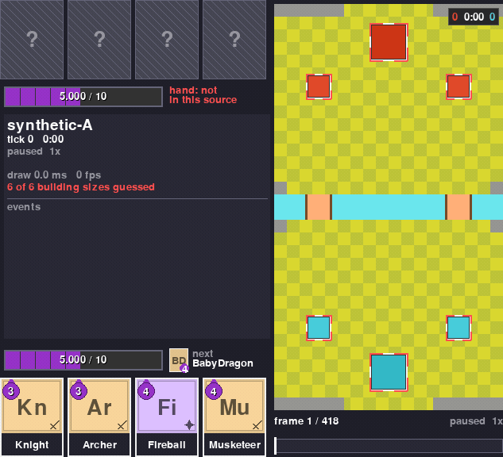<br><b>Replay a recorded match</b><br><sub>Play, pause, step one frame, seek by clicking the bar. The clip is the scripted battle that ships with the tests, so its motion is scripted rather than played by the engine.</sub></td>
    <td width="33%" align="center">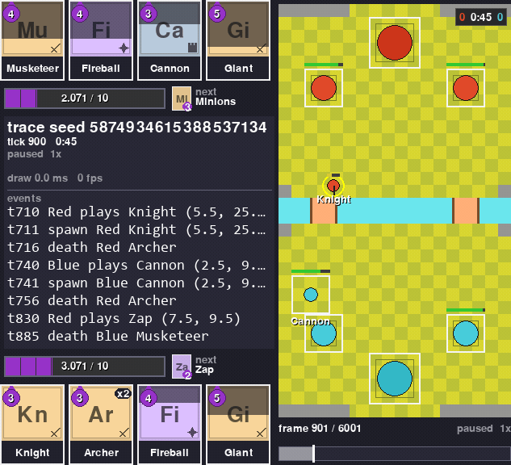<br><b>Open an engine trace</b><br><sub>A battle saved from the engine with one frame per tick. Open it at any tick you like.</sub></td>
    <td width="33%" align="center">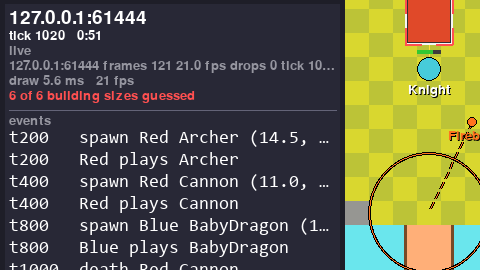<br><b>Watch a training run live</b><br><sub>Attach to a training run in another program. With nobody watching it costs that run 193 ns a step (2026-09-21).</sub></td>
  </tr>
  <tr>
    <td width="33%" align="center">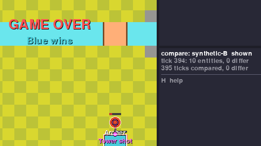<br><b>Compare two recordings of one battle</b><br><sub>Two recordings of one battle should agree, and the viewer says so tick by tick. Here both players recorded the scripted battle that ships with the tests: 395 ticks compared, 0 differ.</sub></td>
    <td width="33%" align="center">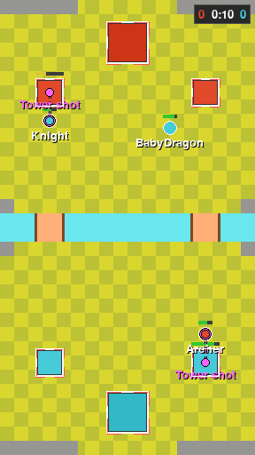<br><b>See where they disagree</b><br><sub>The second source is drawn as hollow ghosts on the first. On a tick where they differ, the ghost steps off the unit. The two recordings in this clip are identical, so nothing steps off here.</sub></td>
    <td width="33%" align="center">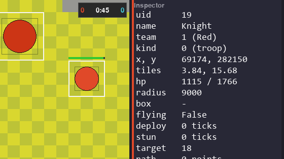<br><b>Inspect any unit</b><br><sub>Click a unit to list every field the source carries, raw and unrounded, except an effect's time left, which shows in tenths of a second.</sub></td>
  </tr>
  <tr>
    <td width="33%" align="center">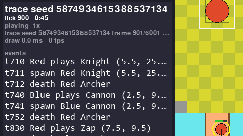<br><b>Follow the event log</b><br><sub>Plays, spawns, deaths and tunnel trips (Miner, Goblin Drill), each with its tick and tile, newest last.</sub></td>
    <td width="33%" align="center">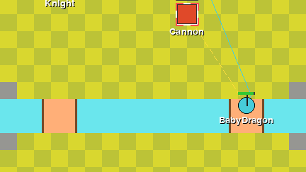<br><b>Paths and target lines</b><br><sub>Recorded units carry the route they walk and the thing they attack. Two keys draw both on the board. Here a Baby Dragon is walking its route while the Cannon aims at it.</sub></td>
    <td width="33%" align="center">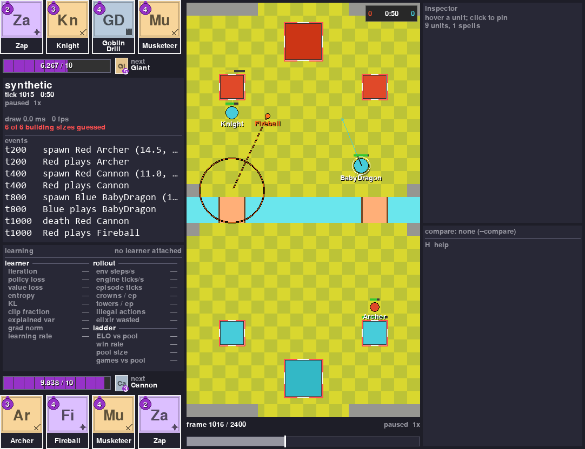<br><b>Render with no display</b><br><sub>Save the window as a PNG with no screen. A scripted battle ships with the tests, so nothing else is needed.</sub></td>
  </tr>
</table>

**The cards.** Each card in a hand is a tile. Its colour and the mark in its corner say whether
it is a troop, a building or a spell. The big letters are its name, and the purple drop is its
cost. A card fills in from the bottom as elixir comes in, so you can see how close it is to
being played, and its white border appears once it can be played. The next card is the small tile by the elixir bar. Two cards can have the same
big letters, like Witch and Wizard. When both are in the deck, the small tile shows other
letters for each: Wt and Wz.

**Evolutions and heroes.** An evolved card gets a dot for each time it was played since its
last evolution, and a pink frame with an EVO tag when its next play is the evolution. A hero
card wears a gold crown, and its ability button sits next to the elixir bar: gold when it can be
used, crossed out once it has been. On the board, an evolved unit gets a pink ring and a hero a
gold one. A unit travelling under ground (Miner, Goblin Drill) is a patch of dirt, and an
invisible one is faded. The board marks show in every source. The hand marks show when you
watch a running battle that has evolutions or heroes. A saved trace does not keep them yet.

**Units on one spot.** Two units of one team can stand on almost the same spot. Then you only
see the one on top, so its name gets a count, like RamRider x2. A Ram Rider shows x2: its
rider sits on its ram. When the source says which unit a rider sits on, the rider is drawn
instead as a small seat with a white rim on top of its ram.

## Save a picture or a clip

<p align="center">
  
  
  
</p>

You can take a picture of any of this for your own write-up. `capture` writes what the window
would show straight to a file, with no window, no display and no clock. It is what made the
images on this page. This example opens the recording that came with your clone, so it runs
from the repo folder with nothing else set up. Swap in your own file or an engine trace, which
[Saving a battle to a file](#saving-a-battle-to-a-file) makes.

```python
from royaleviser.capture import capture
from royaleviser.sources import open_source

capture(open_source("tests/fixtures/frames-synthetic-A.jsonl.gz"), "shot.png",
        ticks=(160, 161, 1), scale=24, crop="left")
```

The whole signature:

    capture(source, out, *, ticks=None, scale=24, view=None, crop="full", fps=20,
            compare=None, theme=DEFAULT, live_timing=False) -> list[Path]

- The suffix picks the format. `.png` writes one file per frame, numbered `name-0000.png` when
  the range holds more than one. `.mp4` and `.gif` encode the range at `fps`.
- `ticks` is `(start, stop, step)` in battle ticks, the clock the window shows, not frame
  indices. Without it the whole source is captured.
- `crop` is `full`, `board`, `left`, or a rectangle. `left` drops the inspector column.
- `compare` ghosts a second source at the same tick. `view` carries the seat, the overlays and
  `hover_uid`, which pins a unit in the inspector.
- The same source and the same arguments give you the same bytes, always. Two numbers move with
  the wall clock: the draw time and the frame rate. Both are zero in every capture, and the LIVE
  pill is never drawn, because a capture replays a file. `live_timing=True` adds the source's
  own status line, which is built from the file, so it is reproducible too.
- PNG needs nothing extra. mp4 and gif are encoded by ffmpeg, which comes with the optional
  `media` extra.

For a sense of size: the whole scripted battle cropped to `left` at scale 16, every 8th tick
(`ticks=(0, 395, 8)`), is a 0.27 MB gif (2026-09-28).

## With the rest of the stack

<p align="center">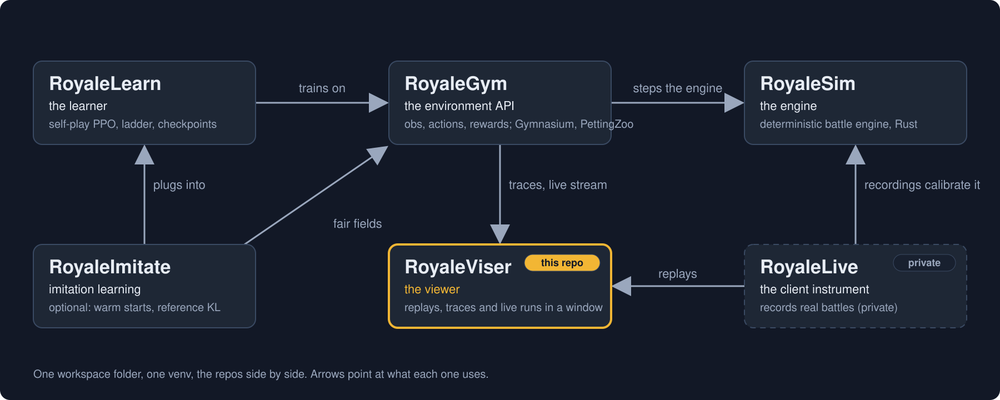</p>

<p align="center">
  <a href="https://github.com/RoyaleGym/RoyaleSim"></a>
  <a href="https://github.com/RoyaleGym/RoyaleGym"></a>
  <a href="https://github.com/RoyaleGym/RoyaleLearn"></a>
  
</p>

| Repo | What it is | To the viewer |
|---|---|---|
| [RoyaleSim](https://github.com/RoyaleGym/RoyaleSim) | the battle engine, written in Rust. It uses whole numbers only, and the same battle always plays out the same way. Its movement is measured against recordings of real battles | every trace and every stream starts here |
| [RoyaleGym](https://github.com/RoyaleGym/RoyaleGym) | the layer your bot plugs into: what it sees, what it can do, what it gets rewarded for. Gymnasium, PettingZoo and self-play flavours | the only sibling this package imports. It gives the viewer the trace format (`royalegym.replay`), the engine-side sender (`royalegym.viser.ViserPublisher`, a *publisher* in the code) and the shape of the arena |
| [RoyaleLearn](https://github.com/RoyaleGym/RoyaleLearn) | the training side: bots playing themselves, PPO (a common training algorithm), a ladder of frozen past opponents, saved checkpoints | a training run streams to the viewer like any other environment |
| **RoyaleViser** (this repo) | the viewer: recordings, engine traces and running environments, in its own window | the window |
| [RoyaleImitate](https://github.com/RoyaleGym/RoyaleImitate) | an optional add-on to RoyaleLearn: config sections that start a bot from saved weights and keep it near a reference policy while it learns | nothing |
| RoyaleLive | private. It records real battles | it writes the recordings the viewer replays and compares |

If you already know RLGym, RocketSim and rlviser, this is the same split. An environment API on
top of an engine, a learner on top of that, and the viewer off in its own process.

**What goes in.** Three things.

- A **recording** of a real battle: `frames-*.jsonl` or `.jsonl.gz`, one line of JSON per frame,
  20 frames a second.
- A **trace** saved from the engine: `.msgpack` or `.json`, written by
  `royalegym.replay.ReplayRecorder`.
- A **stream** from a program running right now: UDP datagrams from a `ViserPublisher`, one per
  environment step.

**What comes out.** PNG stills and mp4 or gif clips, the compare totals, and one frame object
(`royaleviser.model.Frame`) that any other front end can draw from.

The three formats, the rules every frame has to follow and the stream protocol are in
[`docs/internals.md`](docs/internals.md).

### Saving a battle to a file

Save a battle from the engine and you can reopen it here later, at any tick. RoyaleGym's
`ReplayRecorder` writes the file. Pass it `frame_every_tick=True` and it keeps every single
engine tick instead of one frame per environment step:

```python
import numpy as np
from royalegym import (ClashParallelEnv, RandomLegalOpponent, ReplayRecorder,
                       RustEngine, StepLimitCondition, save_trace)

rec = ReplayRecorder(frame_every_tick=True)
env = ClashParallelEnv(RustEngine(),          # RustEngine: the RoyaleSim engine, from Python
                       recorder=rec, truncation_cond=StepLimitCondition(200))
obs, _ = env.reset(seed=2026)
rng, opp = np.random.default_rng(0), RandomLegalOpponent(noop_prob=0.3)
while env.agents:
    obs, *_ = env.step({a: opp.act(obs[a], obs[a]["action_mask"], rng) for a in env.agents})
save_trace(rec.trace, "battle.msgpack")      # 200 steps -> 2001 frames, one per tick
```

200 steps of the environment turn into 2001 frames, one per tick.

### Watching a run that is happening now

A running environment sends frames out instead of writing a file. Set one environment variable
and change no code, or hand it a sender yourself. Then attach from another program.

Nothing is sent until a viewer says hello. Sending stops three seconds after the last viewer goes
away. So you can leave this switched on in a training run you are not watching.

Three things happen, in three different places. First, in the shell where the training run will
start and before it starts, name the address the frames go to. In PowerShell:

```
$env:ROYALEVISER = "127.0.0.1:9870"
```

In `cmd` it is `set ROYALEVISER=127.0.0.1:9870`. On macOS and Linux it is
`export ROYALEVISER=127.0.0.1:9870`. A `set` line typed into PowerShell or bash sets nothing, and
the viewer then waits for frames that never come.

The vectorised environment reads that when you build it. It binds one publisher and watches
game 0. None of your own code changes. Frames only go out while the environment steps, so
something has to step it: your training loop does. This stand-in plays random legal moves in
eight games on the engine:

```python
import numpy as np
from royalegym import ClashParallelEnv, ClashSelfPlayVecEnv, RustEngine

env = ClashSelfPlayVecEnv(8, lambda: ClashParallelEnv(RustEngine()))
env.reset(seed=0)
rng = np.random.default_rng(0)
for _ in range(2000):
    masks = env.action_masks()
    env.step([rng.choice(np.flatnonzero(m)) for m in masks])
```

It ran for 87 seconds on a busy machine on 2026-09-28, which is time enough to attach the viewer.
Leave out the `lambda` and the games run on `MockEngine`, the pure-Python stand-in, with a
warning that no engine was chosen.

Then, in another process, attach the viewer to that same address:

```
python -m royaleviser --stream 127.0.0.1:9870
```

A viewer shows one battle at a time. When you run eight games at once, something has to pick
which one. So the vectorised environment is the thing that reads `ROYALEVISER`: it opens the
sender once and hands it to game 0. Eight games all reaching for the viewer's one UDP port is an
error, not eight streams.

`9870` is a default, not the address. One run holds that port while it streams, so a second run
on the same machine needs its own: `ROYALEVISER=127.0.0.1:9872`, and a viewer pointed at the same
number. A second run started on a port that is taken stops with an `OSError` as soon as it
builds the environment. The message says the port is already in use, almost always by another
run of yours, and tells you to pick another one.

A single environment reads no environment variable of its own. You hand it a sender directly.
`ViserPublisher` comes from `royalegym.viser`, and on its own it sends to `127.0.0.1:9870`:

```python
from royalegym import ClashParallelEnv, RustEngine
from royalegym.viser import ViserPublisher

env = ClashParallelEnv(RustEngine(), viser=ViserPublisher())
```

While a viewer is attached, one msgpack datagram goes out per engine tick. Measured on
2026-09-20 on `MockEngine`, the pure-Python stand-in, not the Rust engine above: 2.6 KB for 18 units (12 troops and the 6 towers, which are units of their own kind,
not a list beside them), and 11 KB for 60. Since 2026-09-24 each unit also carries its target
and the effects on it, and each frame carries the shots in flight, so a datagram is bigger now.
It has not been measured again.

<p align="center">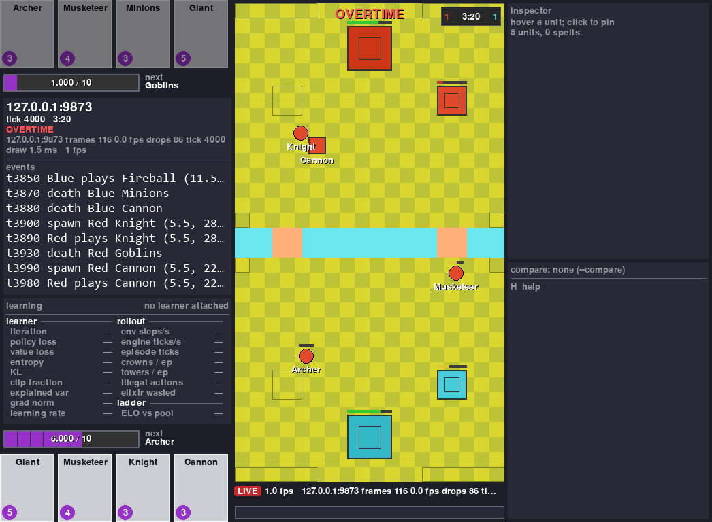</p>

That is a real stream, not the scripted battle. Another process is stepping four self-play
battles on the engine and publishing game 0, and everything in the window arrived over the
socket.

Two things in it are worth reading, and both are properties rather than measurements. The
learner panel is empty because nothing was training when the shot was taken. And the status line
admits dropped frames: the viewer drops them rather than slowing the environment down, which is
the trade it is built to make, and it tells you when it has. On the occasion this shot was taken,
with four other jobs running, that was 86 frames of 116.

### Showing your training numbers next to the battle

The learner can report too, on its own port, and the panel in the dashboard fills in:

```python
import time

from royaleviser.model import Learning
from royaleviser.sources import LearningPublisher

learner = LearningPublisher()                     # 127.0.0.1:9871, the stream's port plus one
for it in range(60):
    time.sleep(1)                                 # your rollout and optimise step go here
    learner.publish(Learning(run="ppo-0007", iteration=it, policy_loss=0.0241, elo=1183))
```

Run it, then attach a viewer from another window with `--stream 127.0.0.1:9870`. The panel
fills within a second or two, and its iteration counts up once a second.

<p align="center">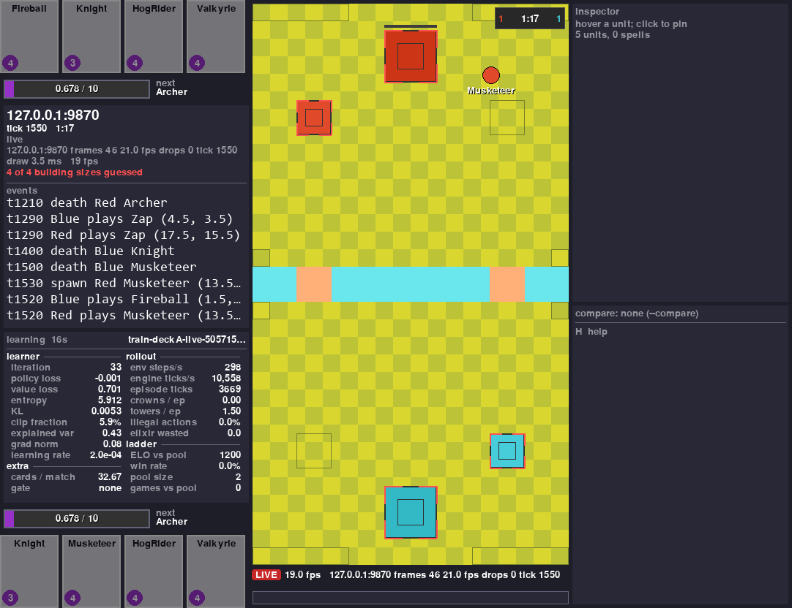</p>

That is the same window on a live battle. The panel under the event log is the learner's, and
every number in it arrived over the network.

This picture is a real training run, on a laptop on 2026-09-22, at iteration 33. Two things in
it are not data, and the picture is here rather than a tidier one because saying so is the
point: `ELO vs pool` and `win rate` read 1200 and 0.0 % because a learner that is still
training is never played against the pool under its own name, so those two tiles read the same
whatever the run is doing. It was a diagnostic run rather than a finished one. Everything else
on the panel is what the learner reported that minute.

It is sent separately from the battle frames and on its own clock, once per training iteration
rather than once per step. So it keeps updating while the learner is busy and nothing on the
board is moving. A viewer that attaches in the middle of a run is sent the last status right
away, instead of waiting for the next iteration.

The heading shows how long ago the last status arrived. On a real run the board stands still
while the learner trains, and that age is how you tell a slow run from a dead one.

One message is the whole status. That is the contract, not a matter of taste: the viewer replaces
what it is holding rather than merging the new message into the old one, so the panel never shows
a mixture the learner never sent at one moment.

A field your learner does not send shows a dash. The panel never puts a zero there. Nobody
reported that number, so it does not pretend one.

Anything the twenty fixed rows cannot hold goes in `Learning.extra`, which is `{name: number or
string}`, drawn underneath in the order you sent it.

If you would rather your learner did not import this package, it can send the same small msgpack
datagram itself. The format and the six constants it has to match are in
[`docs/internals.md`](docs/internals.md).

### Setup

The whole stack shares one setup. The repos sit side by side in one folder, with one virtual
environment at its root. You do not need all of it to use the viewer, so it comes in two parts.

**The short way, for the viewer on its own.** No Rust, no engine build, no game files. You need
Python 3.12 or newer and git. Run these from wherever you keep your projects, one line at a time:

```
mkdir Royale
cd Royale
git clone https://github.com/RoyaleGym/RoyaleViser.git
py -3.12 -m venv .venv
.venv\Scripts\python --version
.venv\Scripts\python -m pip install -e RoyaleViser
```

The venv line asks for Python 3.12 by name. On macOS and Linux it is `python3.12 -m venv .venv`.
If `python --version` already prints 3.12 or newer, `python -m venv .venv` works too. The version
line must print 3.12 or newer before you go on. With an older Python, pip refuses the install
line.

The last line downloads pygame, msgspec and numpy, which is a few tens of MB. You now have the
two recordings that ship with the tests, and the board is drawn from a copy of the arena built
into this package. That is enough for [Try it](#try-it), for streams, and for saving a PNG.

**The rest of the stack**, if you want to open an engine trace or record one yourself. Do the
short way first, because the rest builds on the folder, the environment and the clone it made.
The engine is Rust, so this part also needs a Rust toolchain from [rustup.rs](https://rustup.rs).
Add the other three clones and the build tools, from the `Royale` folder:

```
git clone https://github.com/RoyaleGym/RoyaleSim.git
git clone https://github.com/RoyaleGym/RoyaleGym.git
git clone https://github.com/RoyaleGym/RoyaleLearn.git
.venv\Scripts\python -m pip install maturin pytest hypothesis ruff numpy msgspec
```

Next, generate the card and arena data the engine reads, in `RoyaleSim/data/derived/`. The
engine cannot start without it. A clone carries only `cards-15.535.json` in `data/derived/`;
these lines generate the rest. The copy line is the important one: `cards-15.535.json` is the
table the engine loads. The `extract_cards.py --vintage 2018` line still runs, building the older
table beside it for the cross-engine comparisons that use it. On macOS and Linux the copy is
`cp data/derived/cards-15.535.json data/derived/cards.json`.

```
cd RoyaleSim
..\.venv\Scripts\python tools\extract_arena.py
..\.venv\Scripts\python tools\extract_cards.py --vintage 2018
Copy-Item data\derived\cards-15.535.json data\derived\cards.json
..\.venv\Scripts\python tools\extract_globals.py
```

Then build the engine into the environment, from that same `RoyaleSim` folder. Give it a few
minutes and some free memory. It can go quiet for a minute or more on the engine itself; let it
finish:

```
..\.venv\Scripts\maturin develop --release
cd ..
```

Then install the Python packages, back in the `Royale` folder:

```
.venv\Scripts\python -m pip install -e RoyaleGym
.venv\Scripts\python -m pip install -e RoyaleViser
.venv\Scripts\python -m pip install -e RoyaleLearn
```

One more line, only if you want to train. It is a big download:

```
.venv\Scripts\python -m pip install -e "RoyaleLearn[torch]"
```

Here is what each piece of the viewer needs.

- **Recordings, streams and the scripted battle** need only the virtual environment and
  `pip install -e RoyaleViser`. That pulls in pygame, msgspec and numpy. Without RoyaleGym the
  board is drawn from a copy of the arena built into this package.
- **Opening a trace** needs RoyaleGym as well. RoyaleGym then reads the arena out of the
  RoyaleSim checkout (`data/derived/`, which the `extract_*` lines above generate), not out of
  the engine build.
- **Recording a trace yourself** needs the engine build too, so you need the whole recipe.
- **mp4 and gif out of `capture`** need the `media` extra, which brings ffmpeg with it. A PNG
  needs nothing beyond this package.

## Status

<p align="center">
  
  
  
</p>

The test badge is a clone's run at `1734ed3`, measured with `ROYALELIVE_REPORTS` pointed at
an empty folder. On a machine that has the recordings the same pytest run is 363 passed, 1 skipped.

As of 2026-09-22, this works end to end:

- Replaying a recording, and comparing two recordings of one battle. The pair that ships with the
  tests gives 395 ticks compared, 0 differ.
- Drawing a building at the size the source says it stands on. When a source does not carry that
  size, the viewer marks what it drew rather than guessing quietly: red corner ticks and a count
  of how many sizes on screen are guesses. Since 2026-09-22 frames and traces carry the size, so a
  Cannon is the 3 by 3 building it is in the game, and the marking is there for older files and
  for sources that do not carry one.
- A building is drawn as two shapes, because it has two different sizes and they are easy to
  confuse. The box is the ground it stands on. A new building only goes where its whole box
  fits, so one tapped too close to another is moved to a spot nearby where it does. The circle
  inside is its collision radius, which is what other units bump into. On the
  engine a Cannon stands on 3 tiles with a radius of 0.6 of a tile, a princess tower 3 and 1.0,
  and a king tower 4 and 1.4 (2026-09-22). A source that carries no radius gets no circle rather
  than a guessed one.
- Traces from the engine. A 2001-frame self-play trace draws, and every frame of it passes the
  viewer's own consistency check.
- Streaming from a running environment. A stream carries one frame per engine tick. On 2026-09-24
  a 3,728-tick battle, slowed to about 20 seconds so a person could watch it, sent 3,528 frames,
  none of them dropped for being too big to send. The viewer's own count of frames lost on the way
  was not read. The viewer was open before the battle started. The missing first second is the
  time the run took to hear the viewer's hello, since nothing is sent before that.
- The learning panel. A real training run's status reached the viewer on 2026-09-22. The status
  goes on its own port, whole in one message, and is re-sent to a viewer that attaches in the
  middle of a run.
- Saving a picture or a clip to a file with no window, no display and no clock.
- Effects, spells and shots (2026-09-24). A frozen, stunned, poisoned, slowed or raging unit
  wears a mark of its own. A heal or a shield gets a small sign in its corner. A spell the
  viewer knows is drawn in its family's shape at its card's size. A shot looks like what fired
  it: an arrow, a bullet or a ball. A crown tower's shot is a dot with a white core. The effect
  marks and the shots need a trace or a stream from an engine and a RoyaleGym of 2026-09-24 or
  later. With an older RoyaleGym a trace still opens, but without its shots, its targets and
  every effect except a stun, and nothing says so. What every mark means is in
  [`docs/internals.md`](docs/internals.md#effects-spells-and-shots).
- Every draw redraws the whole window and takes 2-5 ms at 24 pixels per tile. A replay needs 20
  a second, so that is far inside budget. That is why the viewer is Python and pygame and not a
  Rust program.

**Known gaps.** Every one of these is a source not carrying the information. None of them is the
window refusing to draw something.

- A recording gives no unit a radius and no flying flag. So every unit is drawn at one default
  size, and air units look like ground units.
- A trace or a stream gives no unit a path, so the path overlay draws nothing for them. Since
  2026-09-24 they do carry what each unit is attacking, so the target overlay draws. A trace
  saved before then, or an engine or RoyaleGym older than that, gives no targets.
- Spells in a recording come through as projectiles, plus the few whose effect is tagged with its
  card (Fireball, Arrows, Rocket, Log, Barbarian Barrel). There are no rage, poison or freeze
  zones.
- A recording holds only the recording player's hand. The opponent's shows as "hand: not in this
  source" until the results screen. A trace's cycle past the revealed cards shows as "next ?".

A clone of THIS REPO ALONE, installed the short way, runs `pytest -q` to 283 passed and 15
skipped (CI at 3f60535, 2026-09-28, the same on Windows and Linux): the tests that need a
sibling package skip and each says so. That figure is CI's, from a runner that has nothing but
this repo, because this project's development machine has every sibling repo installed and cannot
produce it -- measured there it gives a different pair, which is a different machine wearing the
same name. CI installs the `media` extra as well. Without it one more test skips, so the short
way on its own gives 282 passed and 16 skipped. The counts below are for a machine with the rest of
the stack. Until 2026-09-23 that case could not collect the suite at all, which nothing had ever
run.

Tests. Start in the `Royale` folder. On a clone with the `media` extra installed, the first line
prints 360 passed, 4 skipped (2026-09-28, 1734ed3). Without the extra, which Setup does not
install, it prints 359 passed, 5 skipped (2026-09-28, 1734ed3). The second line prints
`All checks passed!`. Both tools come from the
`pip install maturin pytest hypothesis ruff numpy msgspec` line in [Setup](#setup), so the short
way on its own does not have them:

```
cd RoyaleViser
..\.venv\Scripts\python -m pytest -q
..\.venv\Scripts\python -m ruff check royaleviser tests
```

Three of those skips are tests that pin numbers only a recording of a real battle has. Those
recordings are private, so your clone does not have them, and the run prints "SKIPPED, NOT
PASSED" for each one so nobody mistakes a skip for a pass. The fourth needs a parity results
file from RoyaleSim's replay harness. On the machine that has the recordings, the first three
run and the count is 363 passed, 1 skipped.

Without the `media` extra (`imageio-ffmpeg`), the mp4 and gif test skips as well, and it says so.
Install it with `.venv\Scripts\python -m pip install -e "RoyaleViser[media]"` from the `Royale`
folder. A PNG needs nothing extra.

Read next: [`docs/internals.md`](docs/internals.md) for the frame model, the recording format,
the stream protocol, the command line, the layout, the tests and the performance table;
[RoyaleGym](https://github.com/RoyaleGym/RoyaleGym) for the trace format and the sender that
streams to the viewer; [RoyaleSim](https://github.com/RoyaleGym/RoyaleSim) for the engine the
traces come from.

## Community

Viewer feedback, recording formats and rendering work happen in the project's Discord:
[**https://discord.gg/4D2BS5JBHP**](https://discord.gg/4D2BS5JBHP)

Issues and pull requests on this repo are welcome too.
